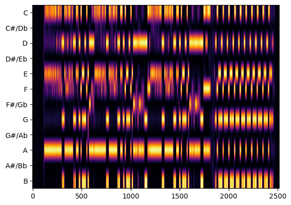
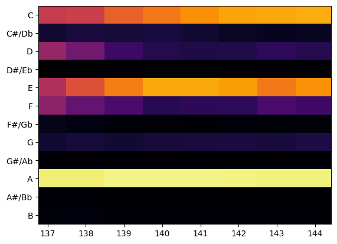

# chordRecognitionSytem_python

## Libraries and dependencies
- tensorflow
- teras
- madmom
- jams
- numpy
- matplotlib
- opencv-python
- pytube
- just_playback

To convert video to wav file need [ffmpeg](https://ffmpeg.org/download.html).

Madmom have his own libraries and dependencies, visit [madmom installation](https://madmom.readthedocs.io/en/latest/installation.html) to more info.

If want to use madmom in Windows, [Microsoft c++ build tools](https://visualstudio.microsoft.com/es/visual-cpp-build-tools/) is needed.
## Download songs
Use songsDownloader.py file to download songs in songs folder, this need jams folder to find YouTube videos.
> `py songsDownloader.py`

In songsDownloaderErrorLog.txt file will find what videos can't be downloaded.

## Generate chromagrams
Use chromagramGenerator.py file to create chromagrams folder, also, this file create a set of train and test data. this file will cut a complete chromagram into pieces, based in jam file.

> `py chromagramGenerator.py`

This is a complete chromagram generated whit madmom based in 25.jams file.

And this is how chromagrams will be saved in chromagrams folder to load in model. This will be without x and y labels and without padding.

## Run model
Use main.py to run model, this just need chromagrams folder.

> `py main.py`
